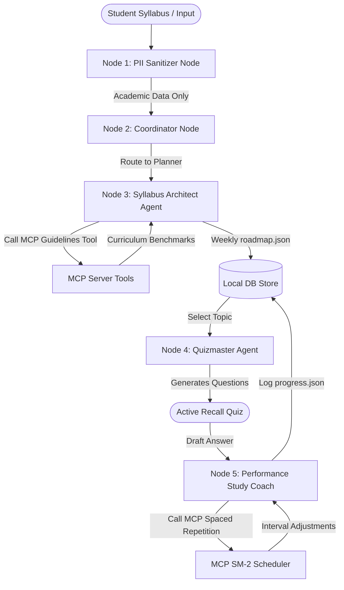
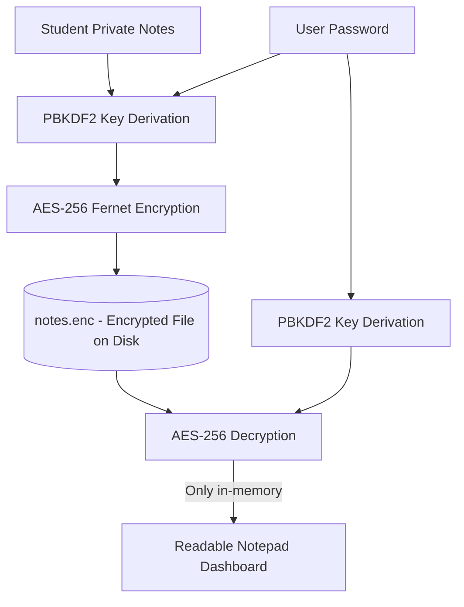

# EduMind: Privacy-First AI Study Concierge & Syllabus Coach

EduMind is an offline-first, privacy-preserving study management and active recall platform. It was designed as a capstone project for **Kaggle's 5-Day AI Agents: Intensive Vibe Coding Course with Google**. 

By combining local AES-256 database encryption, a Model Context Protocol (MCP) server, and a graph-based multi-agent architecture, EduMind helps students structure syllabi and optimize learning schedules without leaking sensitive personal identifiers or intellectual property to cloud services.

---

## 🚀 Core Course Concepts Demonstrated

EduMind implements four core agentic concepts taught in the course:

| Course Concept | How It Is Implemented | Code Location |
| :--- | :--- | :--- |
| **Agent / Multi-Agent System (ADK Graph)** | A graph-based multi-agent execution pattern containing specialized nodes: `PII Sanitizer`, `Syllabus Architect` (Planner), `Quizmaster`, and `Performance Study Coach`. | [`backend/agent.py`](file:///C:/Users/vtnhq/Downloads/capstone%20project/backend/agent.py) |
| **MCP (Model Context Protocol) Server** | A local MCP server exposing standard schemas for system tools: `check_academic_guidelines`, `get_educational_resources`, `calculate_spaced_repetition`, and `secure_save_note`. | [`backend/mcp_server.py`](file:///C:/Users/vtnhq/Downloads/capstone%20project/backend/mcp_server.py) |
| **Advanced Security Features** | Multi-layer local protection: Local AES-256 Fernet symmetric encryption of private notebooks (decrypted in-memory only), combined with an automatic regex-based academic PII filter. | [`backend/security.py`](file:///C:/Users/vtnhq/Downloads/capstone%20project/backend/security.py) |
| **Deployability & Agent UI** | Package dependencies defined in `requirements.txt` paired with a zero-setup `run.py` launcher, serving a glassmorphic dashboard frontend. | [`run.py`](file:///C:/Users/vtnhq/Downloads/capstone%20project/run.py), [`frontend/`](file:///C:/Users/vtnhq/Downloads/capstone%20project/frontend/) |

---

## 🛠️ Architecture Diagrams

### 1. Multi-Agent Graph Flow (ADK System Design)
The student uploads syllabus details. The Coordinator Agent orchestrates the data pipeline across specialized nodes:



### 2. Encryption & Security Perimeter
Private notes are encrypted locally before being stored on disk. Decryption keys are derived dynamically in-memory and are never written to persistent logs:



---

## 📦 Project Directory Structure

```
capstone-project/
├── backend/
│   ├── agent.py         # Multi-agent graph nodes & coordinator (ADK flow)
│   ├── database.py      # Simple JSON storage & secure note manager
│   ├── main.py          # FastAPI application server & routes
│   ├── mcp_server.py    # Model Context Protocol tools & validation
│   └── security.py      # AES-256 encryption & PII sanitizer logic
├── frontend/
│   ├── app.js           # Frontend client router and AJAX actions
│   ├── index.html       # Single Page Application dashboard shell
│   └── styles.css       # Premium glassmorphic styling system
├── db_data/             # Generated database directory (auto-created)
├── requirements.txt     # Python environment requirements
├── run.py               # Auto-launcher script (installs deps and runs app)
└── README.md            # Technical documentation
```

---

## ⚙️ Quick Start Installation

Follow these steps to run the dashboard locally on Windows:

### Prerequisites
Make sure you have **Python 3.10+** installed on your system.

### Launching the Application
1. Open a terminal (PowerShell or Command Prompt).
2. Navigate to the project directory:
   ```cmd
   cd "C:\Users\vtnhq\Downloads\capstone project"
   ```
3. Run the startup utility script:
   ```cmd
   python run.py
   ```
4. The script will automatically:
   - Install dependencies (`fastapi`, `uvicorn`, `cryptography`) in your Python environment.
   - Boot up the local FastAPI web server at `http://127.0.0.1:8000`.
   - Open the EduMind dashboard in your default browser.

### Configuring Live Mode (Optional)
By default, the dashboard runs in **Local Simulation Mode** (no API key required, offline-friendly). To use live LLM generations:
1. Click the **Gemini Settings** button in the top right.
2. Enter your **Gemini API Key** and click **Save**.
3. The indicator will change to **Live Gemini Active** and fetch real, customized study plans and quiz feedback!
